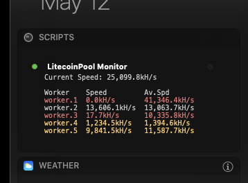

# LitecoinPool Monitor for Today Scripts
This script plugin provides 'at-a-glance' monitoring of your LitecoinPool workers directly from the MacOS Notification Center. It displays current hash rates for your account, as well as rates and averages for each worker. Optional color-coding makes identifying problems with workers visually simple, and alerts to issues quickly. Stats are updated each time Notification Center is opened.

## Screenshots


## Related
If you prefer to monitor your workers from the Menu Bar, check out [https://github.com/jstnryan/litecoinpool-monitor-bitbar](https://github.com/jstnryan/litecoinpool-monitor-bitbar)

## Today Scripts
[Today Scripts](https://github.com/SamRothCA/Today-Scripts) is an extensible application which allows the output of shell scripts to be displayed in the MacOS Notification Center (Today View). There is also a [more recently updated fork](https://github.com/megabitsenmzq/Today-Scripts)

## Setup & Usage
1. Install [Today Scripts](https://github.com/SamRothCA/Today-Scripts) -- you may prefer to check the network tree for a more current fork
1. Start Today-Scripts
1. Create a new script, or modify the default script; click the edit buttom (gear/settings icon) on the right
1. Give the script a title
1. Change the "Program" section to: `/usr/bin/php`
1. Copy the contents of the [litecoinpool-monitor.php](litecoinpool-monitor.php) file to the script code pane
1. Modify the settings at the top of the script shown below to your preference:
   ````php
   // SETTINGS: Enter your LitecoinPool API Key between the quotes below
   // You can find your API key on your LitecoinPool.org account page:
   //  https://www.litecoinpool.org/account
   $apiKey = 'ENTER_YOUR_API_KEY_HERE';

   // Low hash rate threshold (percent); if a worker falls below these thresholds
   // (current vs 24 average) a corresponding warning level will be triggered
   $lowRate = [
       'low' => 10,
       'high' => 20,
   ];
   ````
1. Click `Save Script`

## Dependencies
Aside from Today Scripts, this script uses PHP (CLI) with cURL; both are on nearly every modern Mac.

## License
This script is released under the [WTFPL](http://www.wtfpl.net/).

Copyright 2019 Justin Ryan <jstn@jstnryan.com>
This work is free. You can redistribute it and/or modify it under the
terms of the Do What The Fuck You Want To Public License, Version 2,
as published by Sam Hocevar. See the LICENSE.txt file for more details.